

# M E G R E Z

**`🌈 Make Extendable GPU Resource EASY 🚀`**

**简约、现代、优雅的开源高性能计算平台**

高效管理, 一键创建容器实例, 支持多节点/多GPU, 现代化 UI

环境隔离, 互不干扰, 自定义性能配置

   

  

  

## ✨ 特色简介

✅ 多节点、多GPU支持

✅ 容器实例环境隔离

✅ 用户数据隔离

✅ 深度学习环境预安装

✅ 资源配置自定义调整

✅ 多用户支持

✅ VSCode 网页版

✅ 资源性能监控看板

✅ Jupter Notebook 支持

## 📝 安装 & 使用教程

> [!WARNING]
> 查看 [**>>> 🚧 正在施工中 <<<**]()

## 📌 效果展示

### 登录注册

|           登录            |              注册              |
| :-----------------------: | :----------------------------: |
|  |  |

### 创建实例

| 算力资源                                | 创建实例                          |
| --------------------------------------- | --------------------------------- |
| 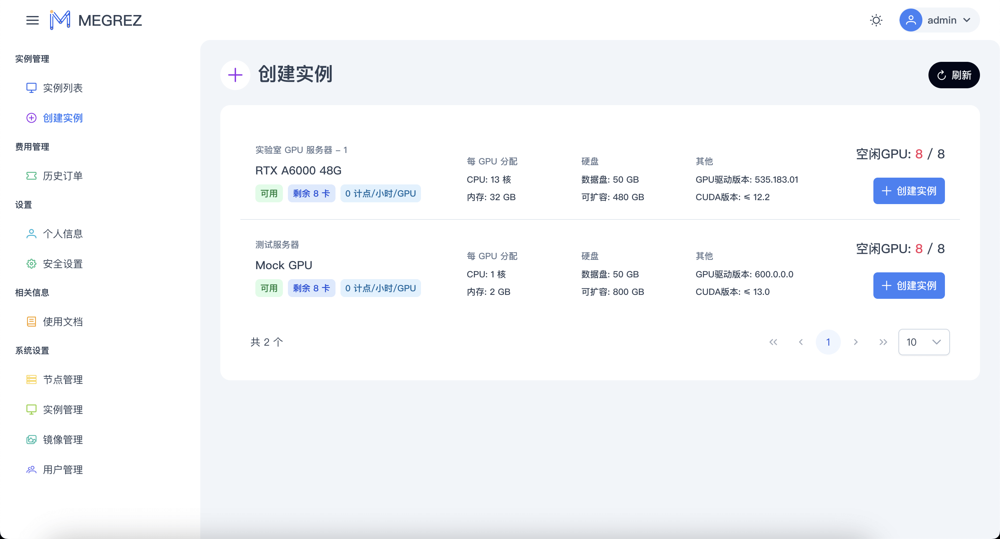 | 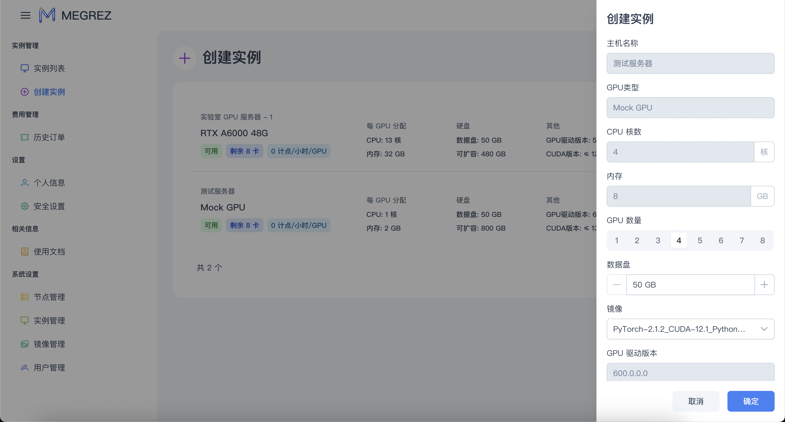 |

### 实例列表

| 实例列表                              | 主机详情                             | 实例详情                               |
| ------------------------------------- | ------------------------------------ | -------------------------------------- |
| 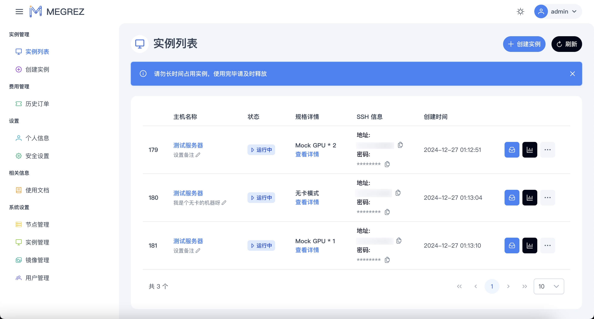 | 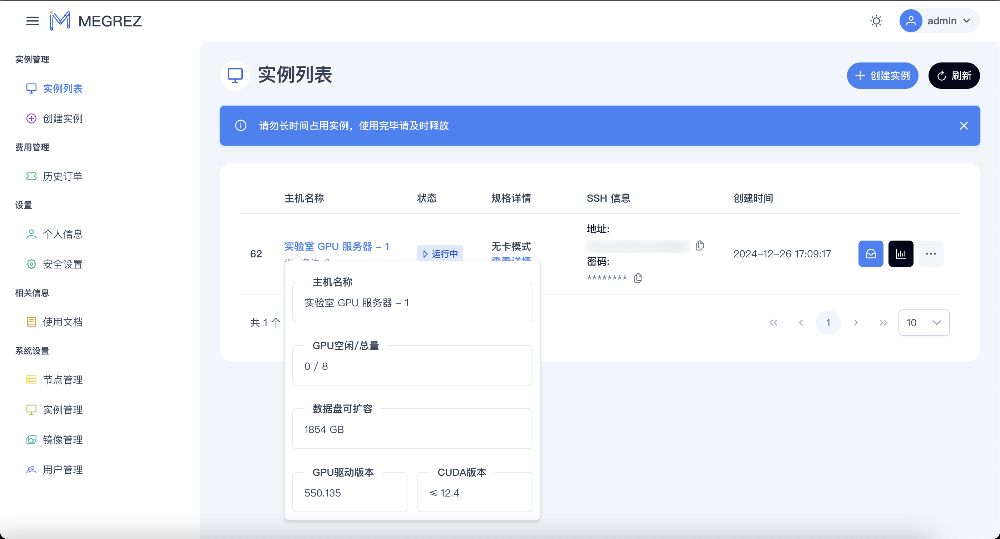 | 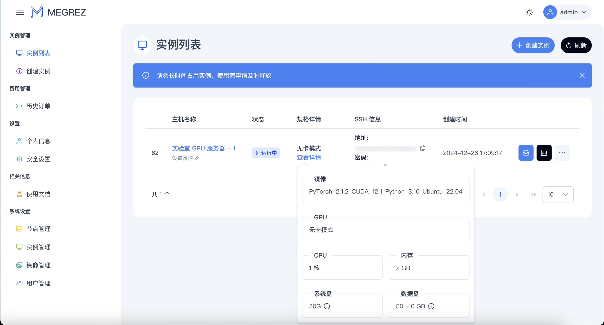 |

| 实例操作                               | 调整实例配置                                |
| -------------------------------------- | ------------------------------------------- |
| 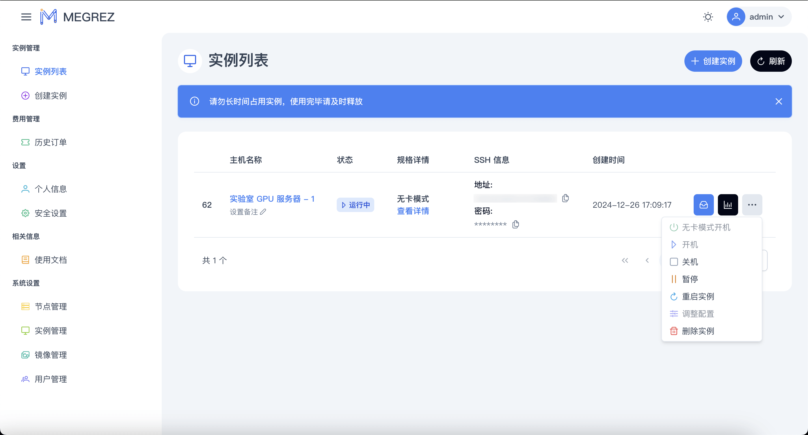 |  |

### 内置功能

| VSCode 网页版                                        | Jupter Notebook                                 | Grafana 资源监控                 |
| ---------------------------------------------------- | ----------------------------------------------- | -------------------------------- |
| 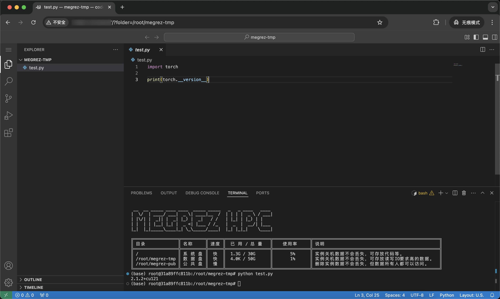 | 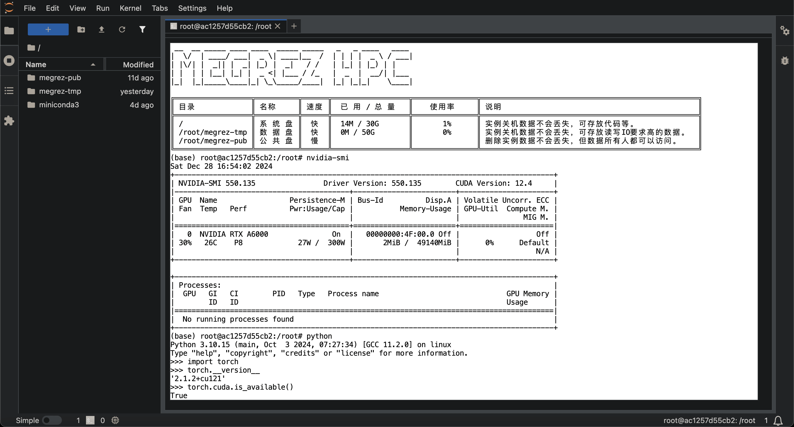 | 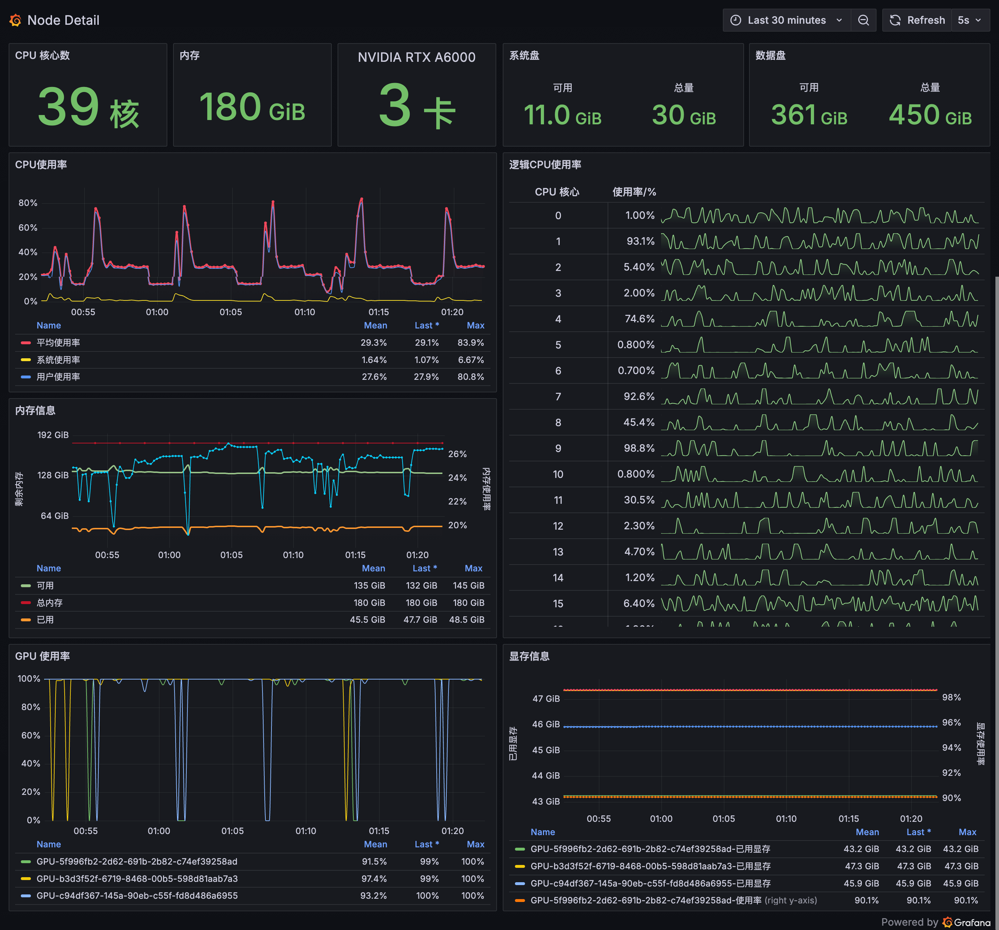 |

### 系统管理

| 节点管理                                              | 实例管理                                |
| ----------------------------------------------------- | --------------------------------------- |
| 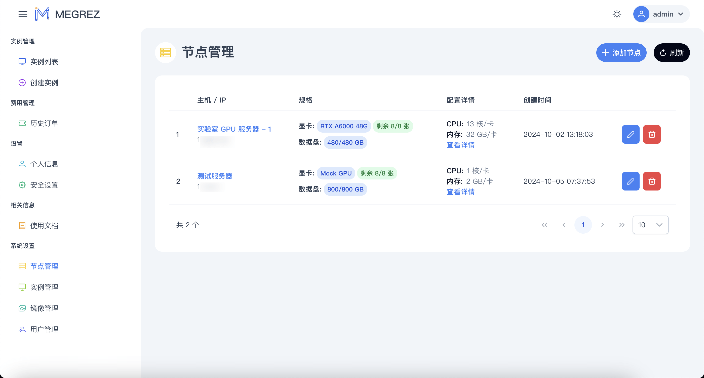 | 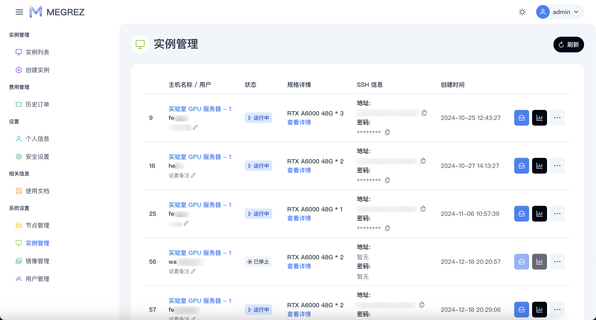 |

| 用户管理                              | 镜像管理                                               |
| ------------------------------------- | ------------------------------------------------------ |
|  | 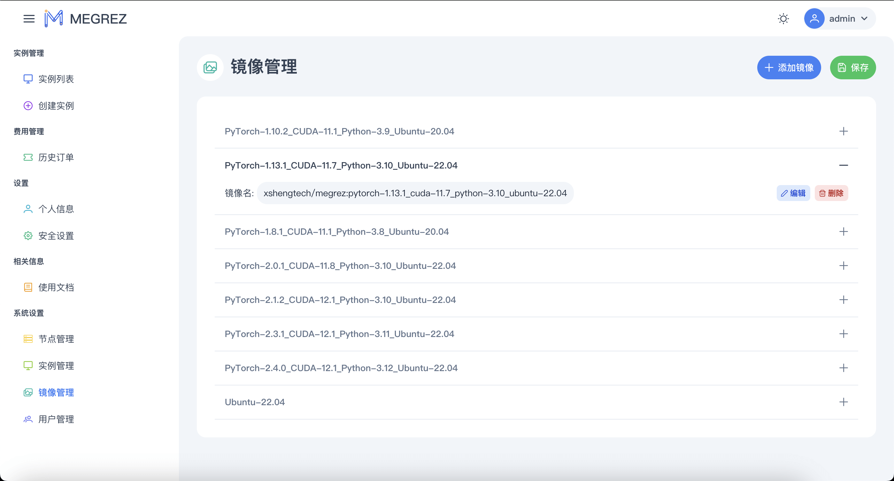 |

## 🙋🏻‍♂️ 用户交流

## ❗️ 免责声明

> [!NOTE]
> 本项目所有功能仅供学习和娱乐交流使用。本项目不对任何由使用本项目产生的直接或间接损失负责, 包括但不限于数据丢失、系统损坏、法律风险等。本项目不保证软件的功能完整性、稳定性、安全性和准确性, 也不保证本项目软件硬件的兼容性。本项目不对运行在软件上的内容进行审核或监督, 用户应自行承担使用本软件的风险和责任。本项目保留随时修改或终止软件的权利, 恕不另行通知。

## ⚠️ 开源许可

> [!CAUTION]
> 请在使用或基于本项目二次开发的时候遵守 AGPL-3.0 开源协议及以下附加条款, 否则 **晓声智能科技 将有权追究法律责任**。

本项目中下的内容采用 AGPL-3.0 协议授权, 您可自由使用。

1. 您可以在遵守 AGPL-3.0 许可证和下述附加条款章节的前提下免费使用这些代码:
2. 如确需闭源，您也可以联系我们购买其他授权,

### 附加条款

基于 AGPL3 协议第七条，您在使用本项目时，需要遵守以下额外条款:

1. 不可移除本项目的版权声明与作者/来源署名; （[AGPL3 7(b)](LICENSE#L356)）
2. 当重分发经修改后的本软件时，需要在软件名或版本号中采用可识别的方式进行注明; （[AGPL3 7(c)](LICENSE#L360)）
3. 除非得到许可，不得以宣传为目的使用作者姓名; （[AGPL3 7(d)](LICENSE#364)）

即:
在您部署 MEGREZ 时，需要保留底部的 晓声智能科技 字样，其中的 MEGREZ 字样需指向 本仓库/fork之一的链接。

若您对源码做出修改/扩展，同样需要以 AGPL-3.0-or-later 开源，您可以以 `Powered by 晓声智能科技, modified by xxx` 格式在页脚注明。

## 🙏 特别鸣谢

> [!TIP]
> 排名不分先后

* [mayooot/gpu-docker-api](https://github.com/mayooot/gpu-docker-api): 提供容器操作代码和思路
* [PrimeVue](https://primevue.org/): 提供前端 UI 框架
* [Sakai](https://github.com/primefaces/sakai-vue): 提供 UI 设计风格语言
